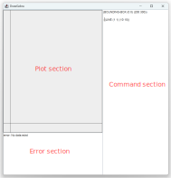
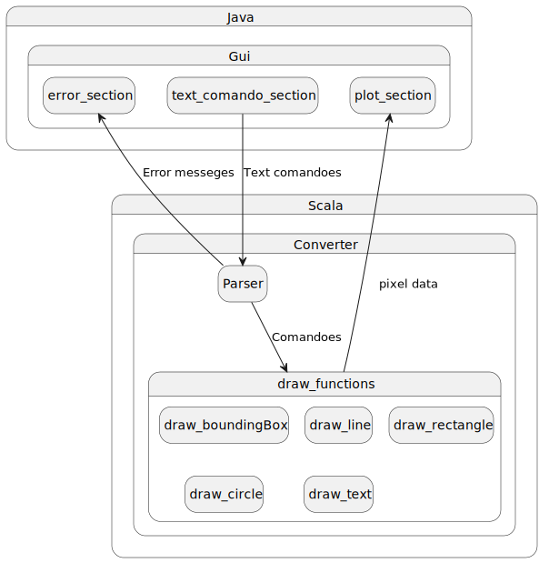
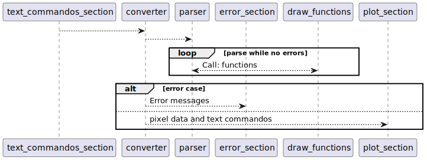
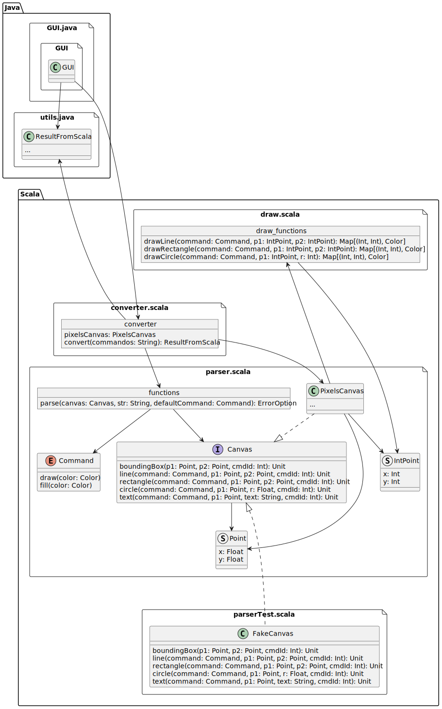
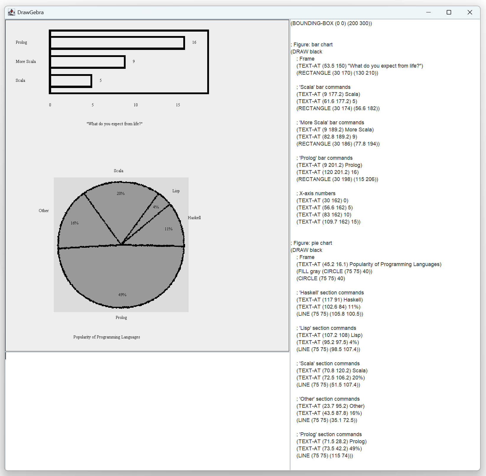

# Plotting tool report

<!-- 

Logika is using a SMT solver .


For the presentation:
- Demonstrating the tool
- Talk about the applied prof technics.
- Maybe talk about the architecture.
- Something may work and something may not work.
- It may take like 5 to 7 or 10 min for a group so it is not much.


For the project report:
- Max 6 pages
- The architecture
- Screen shots
- How is it testes
- How you have used prof technics.

 -->

The plotting tool have 3 section as shown on the following figure.


Section overview

## The architecture

The code in Java is responsible for the GUI. It reads the text in the *command section* and calls and Scala function which return an *data structure* in form og an *java record*. The returned data structure containing all the of x and y coordinates for each pixel together with an color. The data structure also contains an error string. The parsed text commandos is also a part of the data structure because the text is drawn directly in java.

It means Scala is responsible for the parsing and for handling for error handling and for the 3 drawing functions `drawLine()`, `drawRectangle()` and `drawCircle()`. In addison the highlight on the last drawn commando is also handles in scala. Because the text drawings not is handles in scala but sent directly bach to java after parsing the highlight functionality does not includes the drawn text.

The 3 drawing functions is implemented as pure functions meaning they do not have sideeffect.

Here is the interface for the `drawCircle()` function. The `drawLine()` `drawRectangle()` functions follows the same logic.
``` scala
// The argument 'command' contains information about if it is and 'draw' or 'fill' command and the color
def drawCircle(command: Command, p1: IntPoint, r: Int): Map[(Int, Int), Color] =...
```

The parser is made so it also supports comment. An single line comment is `;` and a block can be be commented with `(command ...)`

``` clj
(BOUNDING-BOX (0 0) (200 300))

; Figure: pie chart
(DRAW black 
    ; Frame
    (TEXT-AT (45.2 16.1) Popularity of Programming Languages)
    (comment (FILL gray (CIRCLE (75 75) 40))))
```
Command section code example


### Conceptional overview
An simplified overview of the data flow in shown on the following diagram.  

Conceptional overview diagram
<br><br>

<!-- 
## Sequence

 -->


### Class diagram


Limited class diagram of the dependencies

## Usage example




## Testing and prof technics

The gui is tested by visually verify that the functionality is as intended. The parser is tested by use of unittest.
Scala has a rich typing system that that gives some great guarantees at compile-time. E.g. Scala's `case class` combined with and match statements works great. And functional style has also helped reducing the states of the program.

Some of the code has been implemented in scale with full or simplified functionality. Logika is used to verify inbound checks and for ensuring en while loop can make progress. Some of the code is defined recursive. There is made an attempt to verify an while loop version of a simplified version of the drawRectangle. In Scala we can avoid out of bound checks by the use of more safe techniques like use of iterators or string functions. Instead of handling the strings as sequences as we have done in slang. By using a iterator based for loop instead of an while loop also means we do not need to check for termination conditions.

There is implemented and simplified version of the `drawRectangle()` function containing an while loop where there is made an invariant for the generated sequence. We have not managed to make Logika verify that the loop invariant holds. It is unknown if the risen for this is because Logical are finding an corner case or because the invariant is defined in an way that is too hard for Logika to verify before it times out. Some of the slang code is also unattested. It makes it easier to make Logika verify the code when you have some level of verification before hand.


Here is an example of how the `text.isInBound()` is used to verify that the first index is safe to access.

``` scala
@strictpure def head(text: MSZ[String]): String = {
  if (text.isInBound(0)) {
    text(0)
  } else {
    ""
  }
}

```

The simple `Head()` function is then later on used to define more advanced function where the inbound check is not needed as we have done in the following code. 

``` scala
@strictpure def removeCommentsHelper(first: String, rest: MSZ[String], commentActive: B): MSZ[String] = {
  if (first == "") {
    MSZ[String]()
  } else if (first == "\n") {
    removeCommentsHelper(head(rest), tail(rest), false)
  } else if (first == ";" | commentActive) {
    removeCommentsHelper(head(rest), tail(rest), true)
  } else {
    first +: removeCommentsHelper(head(rest), tail(rest), false)
  }
}

@strictpure def removeComments(inData: MSZ[String]): MSZ[String] = {
  removeCommentsHelper(head(inData), tail(inData), false)
}
```
