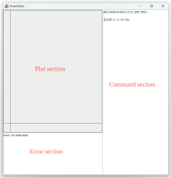
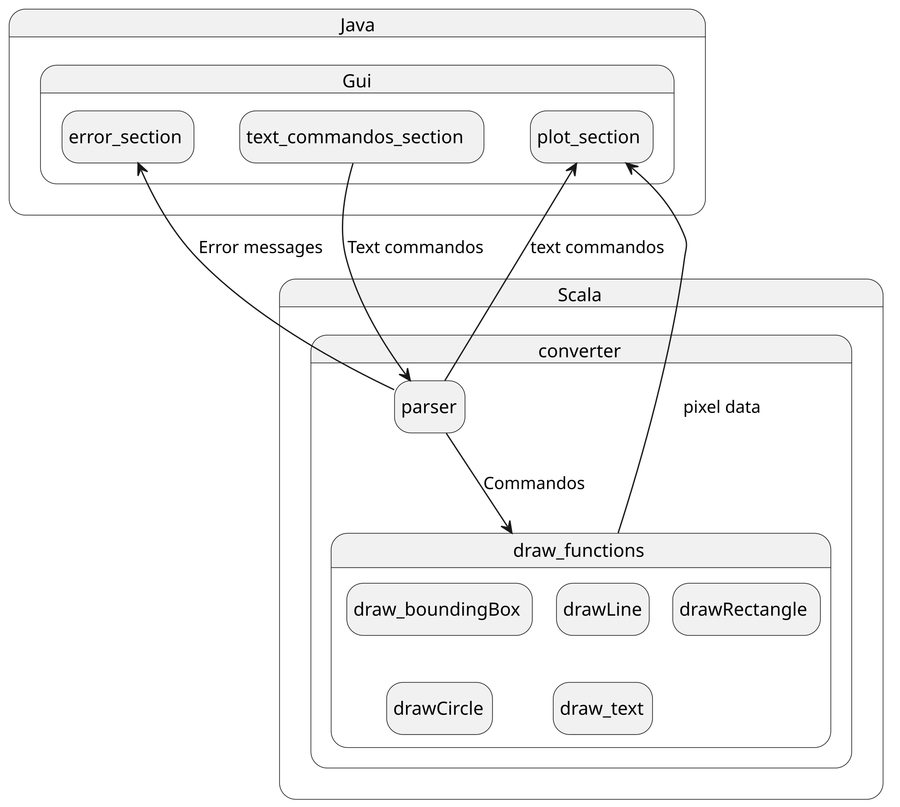
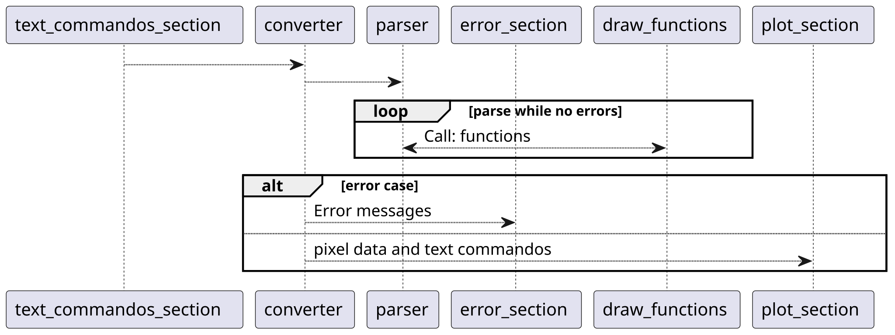
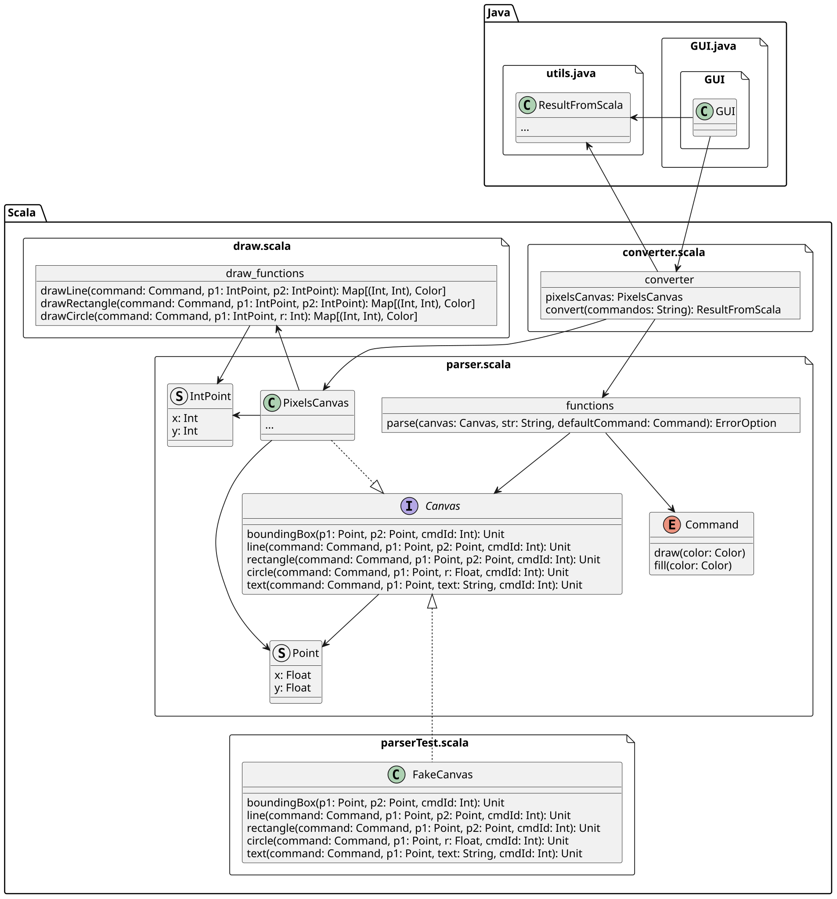
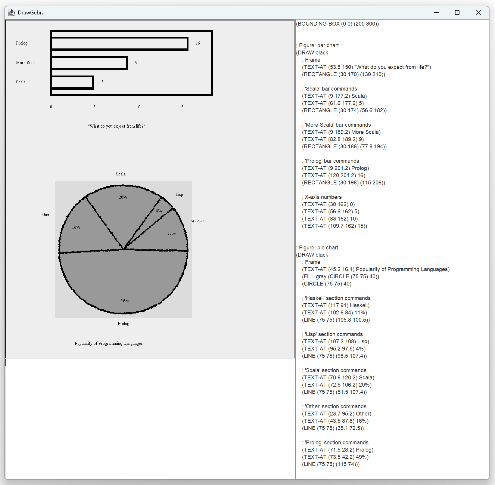

# Documentation

<!-- 
For the project report:
- Max 6 pages
- The architecture
- Screen shots
- How is it testes
- How you have used prof technics.
-->

The plotting tool have 3 section as shown on the following figure.


Section overview

## The architecture

The code in Java is responsible for the GUI. It reads the text in the *command section* and calls a Scala function, which returns a data structure in the form of a Java record. The returned data structure contains all the x‑ and y‑coordinates for each pixel together with a color value. It also includes an error string. The parsed text commands are part of the data structure as well, because the text is drawn directly in Java.

This means Scala is responsible for parsing, error handling, and the three drawing functions: `drawLine()`, `drawRectangle()`, and `drawCircle()`. In addition, the highlighting of the last executed command is also handled in Scala. Because text rendering is handled in Java, it is not included in the highlight functionality.

As stated in the task description, the draw command has no upper bound on the number of arguments:  
`(DRAW c g1 g2 g3 ...)`  
This means a base color can be specified for multiple commands at once. Commands can also be nested, where the innermost command takes priority.


``` clj
; The principle of nested commands.
; Where g1 is drawn with blue and g2 is filled with black and g3 is drawn with red.
(DRAW red (DRAW blue g1) (FILL black g2) g3)
```

The 3 drawing functions is implemented as pure functions meaning they do not have sideeffect.

Here is the interface for the `drawCircle()` function. The `drawLine()` and `drawRectangle()` functions follows the same logic.
``` scala
// The argument 'command' contains the color and information about if it is a 'draw' or 'fill' command.
def drawCircle(command: Command, p1: IntPoint, r: Int): Map[(Int, Int), Color] =...
```

The parser is made so it also supports comments. An single line comment is `;` and a block can be commented with `(command ...)`

``` clj
(BOUNDING-BOX (0 0) (200 300))

; Figure: pie chart
(DRAW black 
    ; Frame
    (TEXT-AT (45.2 16.1) Popularity of Programming Languages)
    (comment (FILL gray (CIRCLE (75 75) 40))))
```
Command section code example


### Conceptional overview
An simplified overview of the data flow is shown on the following diagram.



Conceptional overview diagram

<br><br>

<!-- 
## Sequence

 -->


### Class diagram



Limited class diagram of the dependencies

## Usage example



Example of the tool in usage

## Testing and prof technics

The GUI is tested by visually verifying that the functionality behaves as intended.  
The parser is tested using unit tests.

Scala has a rich type system that provides strong guarantees at compile time.  
For example, Scala's *case class* combined with match statements works very well.  
Some *functional‑style* programming techniques are used, which can reduce the number of program states.

Some of the Scala code is also implemented in Slang with either full or simplified functionality.  
Logika is used to verify that indices are within bounds and to ensure correct while‑loop progression.

In Scala, we can avoid out‑of‑bounds errors by using safer techniques such as iterators or string functions, instead of handling strings as sequences as we have done in Slang.  
Using an iterator‑based *for loop* instead of a *while loop* also removes the need for verify termination.

A simplified version of the `drawRectangle()` function has been implemented, containing a *while loop* with an invariant defined for the generated sequence.  
We have not been able to get Logika to verify that the loop invariant holds.
It is unclear whether this is because Logika has found a corner case, or because the invariant is defined in a way that is too complex for Logika to verify before it times out.

Some of the Slang code is also unit tested. It makes it is easier to make Logika verify the code when you have some level of verification beforehand.

Here is an example of how the `text.isInBound()` is used to verify that the first index is safe to access.

``` scala
@strictpure def head(text: MSZ[String]): String = {
  if (text.isInBound(0)) {
    text(0)
  } else {
    ""
  }
}

```

The simple `Head()` function is then later on used to define more advanced function where the inbound check is not needed as we have done in the following code. 

``` scala
@strictpure def removeCommentsHelper(first: String, rest: MSZ[String], commentActive: B): MSZ[String] = {
  if (first == "") {
    MSZ[String]()
  } else if (first == "\n") {
    removeCommentsHelper(head(rest), tail(rest), false)
  } else if (first == ";" | commentActive) {
    removeCommentsHelper(head(rest), tail(rest), true)
  } else {
    first +: removeCommentsHelper(head(rest), tail(rest), false)
  }
}

@strictpure def removeComments(inData: MSZ[String]): MSZ[String] = {
  removeCommentsHelper(head(inData), tail(inData), false)
}
```
